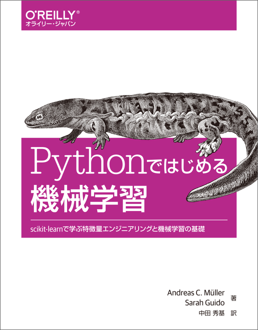

# 概要
O'REILLYの書籍

「Pythonではじめる機械学習　scikit-learnで学ぶ特徴量エンジニアリングと機械学習の基礎」を基に，コードを写しながら学習したもの

# 1章 はじめに

[はじめに](./notebooks/1章_はじめに/1章_はじめに.ipynb)
# 2章 教師あり学習
教師あり学習は，最もよく用いられ，そしてうまく機能しているタイプの機械学習だ．本章では教師有学習について詳しく述べ，いくつかのよく使われる教師有学習アルゴリズムについて説明する．本章では教師有学習について詳しく述べ，いくつかのよく使われる教師あり学習アルゴリズムについて説明する．
## 2.1 クラスの分類と回帰
- 教師あり機械学習問題
    - **クラス分類** あらかじめ定められた選択肢の中から**クラスラベル**を予測すること
        - **２クラス分類** ２つだけのクラスを分類する特殊ケース（答えがyes/no）
        - **多クラス分類** ３つ以上のクラスを分類する問題（アイリス，Webサイトのテキストから，そのWebサイトの使用している言語を予測する問題）
    - **回帰** 目的は連続値の予測．（ある人の年収を学歴と年齢と住所から予測する/トウモロコシ農家の収穫量を，前年の収穫量，天候，従業員数から予測する）
 
クラス分類問題と回帰分類問題を区別するには，出力に何らかの連続性があるかを考えてみればよい．出力に連続性があるなら回帰問題である．

## 2.2 汎化，過剰適合，適合不足
### 2.2.1 モデルの複雑さとデータセットの大きさ

## 2.3 教師あり機械学習アルゴリズム
### 2.3.1 サンプルデータセット
[2_3_1__1_サンプルデータ](./notebooks/2_3_1__1_サンプルデータ.ipynb)  
[2_3_1__2_ウィスコンシン乳がんデータセット](./notebooks/2_3_1__2_ウィスコンシン乳がんデータセット.ipynb)  
### 2.3.2 k-最近傍法  
[2_3_2__1_k-最近傍法](./notebooks/2_3_2__1_k-最近傍法.ipynb)  
[2_3_2__2_scikit-learnを用いて](./notebooks/2_3_2__2_scikit-learnを用いて.ipynb)  
[2_3_2__3_実際のcancerデータセット](./notebooks/2_3_2__3_実際のcancerデータセット.ipynb)  
### 2.3.3 線形モデル  
[2_3_3__1_線形モデルによる回帰](./notebooks/2_3_3__1_線形モデルによる回帰.ipynb) 
### 2.3.4 ナイーブベイズクラス分類器
### 2.3.5 決定木
### 2.3.6 決定木のアンサンブル法
### 2.3.7 カーネル法を用いたサポートベクターマシン
### 2.3.7 ニュートラルネットワーク（ディープラーニング）

## 2.4 クラス分類器の不確実性推定
### 2.4.1 決定関数（Decision Function）
### 2.4.2 確率の予測
### 2.4.3 多クラス分類の不確実性

## 2.5 まとめと展望